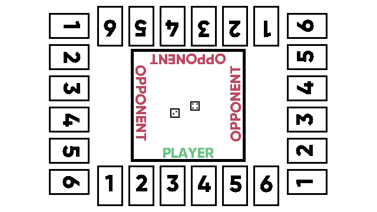

# Whisky_Game

## Overview

The game is played by four people, one player and three AI. Each player has six cards in front of them. They are numbered 1 – 6. The objective is to be the first player to turn all their cards over. This is done by rolling two dice. The player can turn over one card that corresponds with the number on one of the dice or the number of the two added together.
For example:
They roll a 3 and a 2. They can choose to turn over either the card with number 3, number 2, or number 5. Only one of them.
Each player rolls once then the next player rolls. The first to have all their cards flipped over wins.

## Rules

    1. Four players each with six cards
    2. They roll the dice and choose one card that matches one of the dice or the two numbers added together
    3. If they roll a double, they can choose to re-flip an opponent’s card of the number on the dice
    4. The player can turn over one card each turn
    5. Each player rolls once then the next person goes
    6. First to have all their cards face down wins.

_NOTE: Number of cards may be increased._

## AI

The AI will be very basic. If they can choose between multiple cards, they will pick one at random. If they get a chance to flip and opponents’ card back, they will always do it.
Ideally each opponent would act differently but they rules are so basic it probably wouldn’t matter.

## Basic Screen Layout

